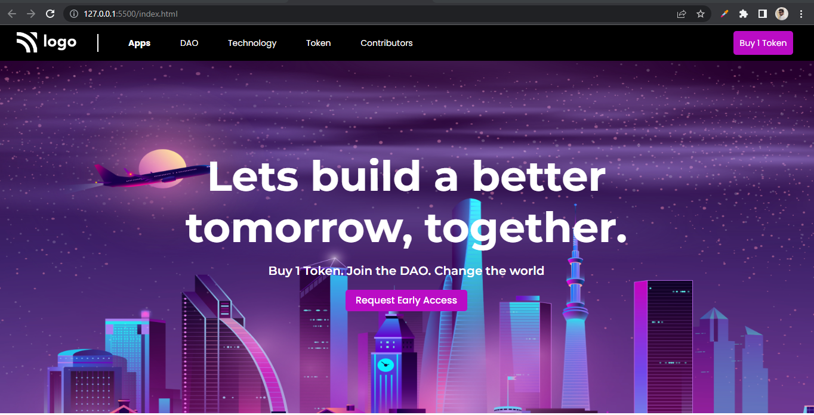

# Assignment 5

## Project 5 [Live Link](https://nachiketkeripaleproject5.netlify.app/)

-  Used flexbox and position for this project 
-  Used :hover selector on list item. 
-  Used Goolge Fonts for this project.
-  Got idea about border propertys, used border-left property in this project.

---

## Time taken to finish this project

-   3.5 hour to complete it.

#### Screenshot

 

